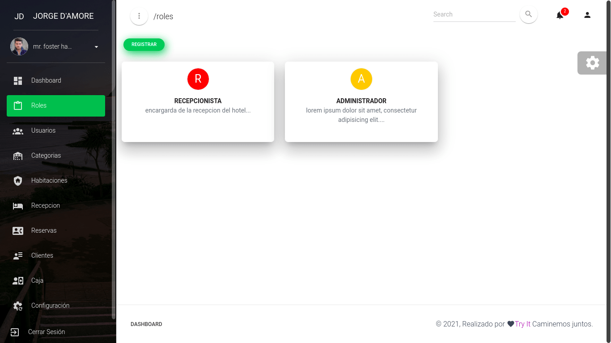
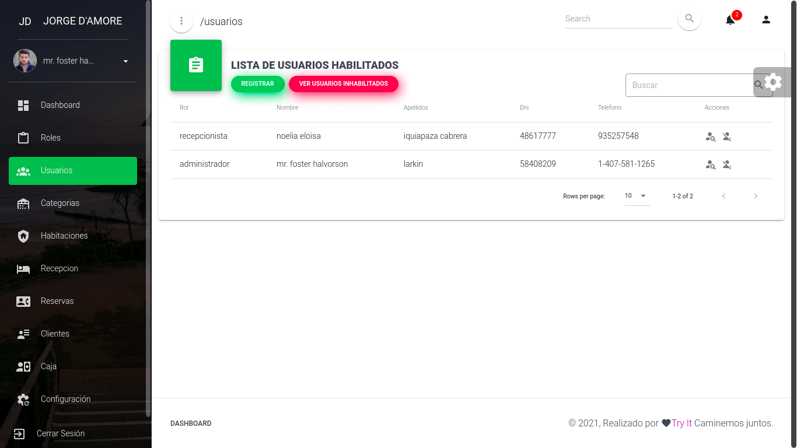
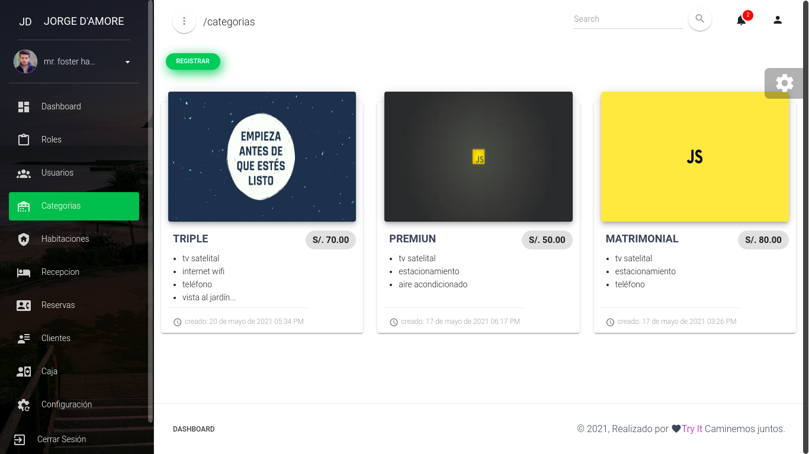
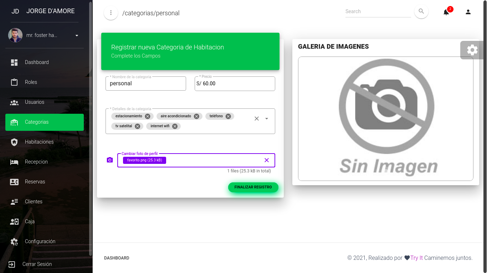
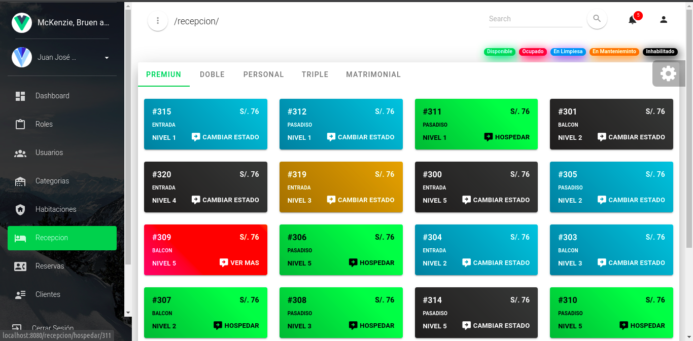
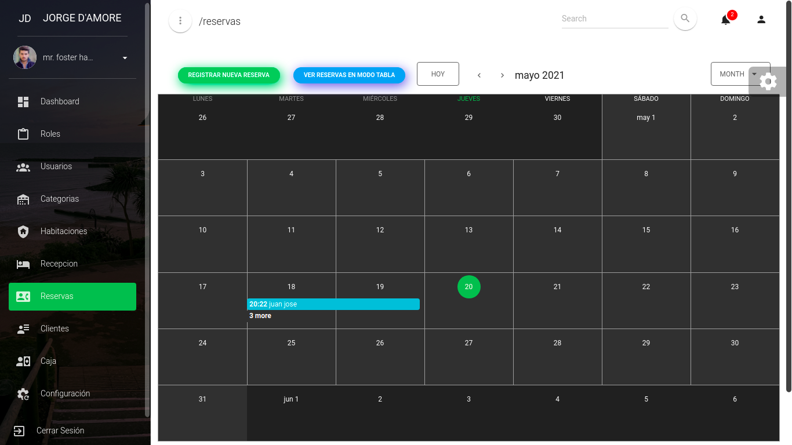
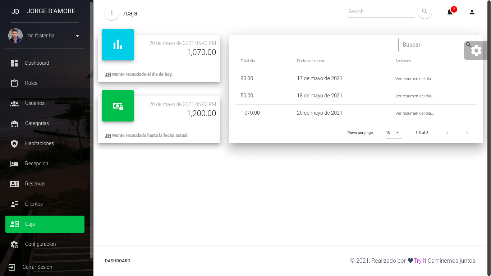

# Hotel Management App

## This application is created for hotel administration and management

* Dashboard
* Roles
    * Create
    * Update
* Users
    * List users (enabled or disabled)
    * Creates a user and is assigned a role
    * Update
    * Disabled or enabled Users
* Categories
    * List Categories
    * Create
    * Update
* Rooms
    * List rooms by status available, occupied, cleaning, maintenance, disabled
    * Create
    * Update
* Reception
    * List of categories with their respective rooms
    * Host a guest
    * See the information of the guest hosted
* Reservation
    * List reservation by tables and calendar
    * Create a new reservation by call or social networks
* Guests
    * List of Guests
* Box
    * List of the last movements for each day
* Hotel Config
    * Update hotel data

### Screenshot
#### Page Roles

#### Page Users

#### Page Categories

#### Page Categories Create a new Category

#### Page Reception

#### Page Reservation

#### Page box

